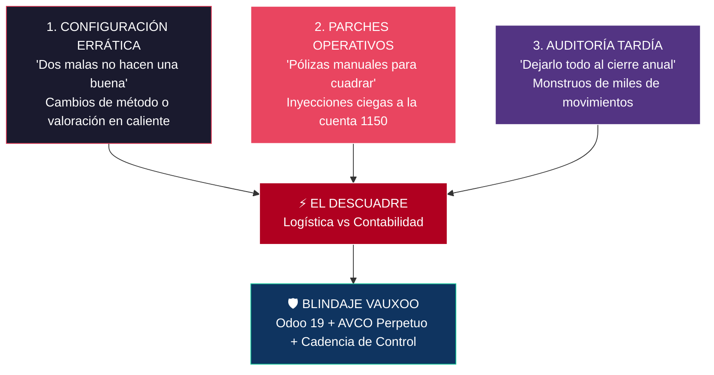
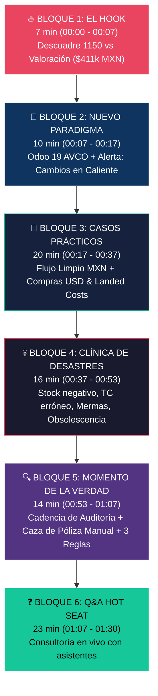

# 🎯 Plan Definitivo v4: Masterclass 2026

## "De la logística a la contabilidad: Domina la valoración de inventarios en Odoo 19.0"

---

| Dato | Detalle |
|------|---------|
| **Ponente** | Julio Serna — PM y Experto Funcional en Vauxoo |
| **Duración** | 90 minutos (1h 30min) estrictos |
| **Formato** | Virtual, en vivo |
| **Precio** | \$100 USD |
| **Versión** | Odoo 19.0 Enterprise |
| **Localización** | México — Moneda Base MXN, Plan Contable Mexicano (SAT) |
| **Método de Costeo** | Costo Promedio (AVCO) — enfoque exclusivo y perpetuo |
| **Audiencia** | Contadores, Controllers, Consultores Odoo y Directores Financieros en México |
| **Entregables** | Certificado · Grabación HD · Checklist de Auditoría MX (con Matriz de Cadencia) · Tabla de Mapeo 18→19 |

---

## 🧭 Marco Narrativo: Las 3 Causas Raíz del Divorcio Contabilidad-Logística

Toda la masterclass está hilada bajo las tres grandes causas reales detectadas en más de una década de implementaciones en México:

1. **Configuración (Bloque 2):** *Dos configuraciones malas no hacen una buena.* Cambiar métodos en caliente (periódico ↔ perpetuo, standard ↔ FIFO ↔ AVCO) deja brechas permanentes silenciosas porque Odoo 19 no genera asientos retroactivos automáticos sobre el stock preexistente.
2. **Operación (Bloques 1 y 5):** *El parche manual.* Ante la presión del cierre, el contador inyecta una póliza manual directa a la cuenta 1150 para forzar el cuadre, creando una fractura irreversible entre el libro mayor y el almacén.
3. **Auditoría (Bloque 5):** *El costo de la infrecuencia.* Los descuadres pequeños no atendidos se convierten en bolas de nieve inauditales. La solución es adoptar la disciplina de cadencia: Diario (Excelente), Semanal (Recomendado), Mensual (Bueno), Anual (Evitarlo).

---

## ⏱️ Cronograma Minuto a Minuto Rebalanceado (90 min)

---

### Bloque 1: EL HOOK — "El Dolor que Todos Conocen"
**⏰ 00:00 – 00:07 (7 min)**

| Elemento | Detalle |
|----------|---------|
| **Apertura** | Bienvenida de Julio Serna. Contexto: Experiencia Vauxoo en implementaciones contables e inventarios en México. |
| **Hook Visual** | Pantalla dividida en vivo: **Balanza de Comprobación (Cuenta 115.01.01)** con **\$487,200.00 MXN** vs. **Reporte de Existencias / Valoración** con **\$75,925.00 MXN**. Diferencia real de **\$411,275.00 MXN**. |
| **Pregunta al chat** | *"¿A quién le ha tocado explicarle este descuadre al Director General, al auditor externo o peor… al SAT? Pongan 🔥 en el chat"*. |
| **La Promesa** | "En los próximos 90 minutos van a dominar el Costo Promedio en Odoo 19.0. Comprenderán las 3 causas raíz que divorcian almacén y contabilidad, aprenderán a blindar sus importaciones en dólares y resolveremos este descuadre en vivo en menos de 5 minutos". |

---

### Bloque 2: EL NUEVO PARADIGMA — "Odoo 19.0 y la Trampa de la Configuración"
**⏰ 00:07 – 00:17 (10 min)** *(+2 min asignados para advertencia técnica)*

**Contexto México y Arquitectura (6 min):**
- ¿Por qué AVCO perpetuo es la norma en México? → NIF C-4 y deducción de costo de ventas ante el SAT.
- **La gran simplificación en Odoo 19:**
  - 🚫 **Adiós SVL (Stock Valuation Layers):** La valoración vive integrada directamente en cada `stock.move`.
  - 🚫 **Adiós cuentas puente interim:** Asientos contables automáticos y directos a la cuenta de inventarios 1150.
  - 🔄 **Terminología formal:** De 'Anglo-Sajona/Continental' a 'Periódico vs Perpetuo'.
  - ✅ **Nuevo menú:** *Contabilidad > Informes > Inventario / Existencias*.

**Causa Raíz #1: La Trampa de las Configuraciones en Caliente (4 min):**
- *Historia de guerra / Principio:* **"Dos configuraciones malas no hacen una buena"**.
- El error típico: Arrancar la empresa con valoración periódica (manual). A los 4 meses darse cuenta y cambiar la categoría a perpetua. Ver números extraños y pasarla a FIFO "para probar", y luego a AVCO.
- **Lección técnica basada en laboratorio Odoo 19:**
  - Odoo 19 **NO** genera pólizas contables retroactivas de ajuste por el simple cambio de método de costeo o valuación en la categoría.
  - El inventario físico anterior queda flotando sin soporte contable, creando una brecha silenciosa permanente en el balance.
  - *Mensaje al asistente:* La categoría de producto no es un área de juegos; una vez que hay operaciones, los cambios de método requieren un corte formal de saldos y asientos de reclasificación planificados.

---

### Bloque 3: CASOS PRÁCTICOS — "AVCO en Acción"
**⏰ 00:17 – 00:37 (20 min)**

> [!WARNING]
> Todos los flujos ya están pre-configurados en la base de datos `masterclass`. El ponente navega, resalta apuntes contables y muestra fórmulas matemáticas. Cero captura manual lenta en vivo.

**CASO 1: Flujo Limpio en MXN (8 min — 00:17 a 00:25)**
- Producto `[WIDGET-MX] Widget Nacional MX (AVCO)`.
- Muestra la ponderación matemática: 50 u @ \$150 + 50 u @ \$170 = 100 u @ **\$160.00 MXN**.
- Venta y entrega de 30 unidades: Asiento inmediato de Costo de Ventas (cargo 501.01.01, abono 115.01.01 por \$4,800.00 MXN).
- *"En v19 vemos la mitad de apuntes que en v18. El flujo es limpio y transparente. Pero la realidad mexicana exige comprar en el extranjero..."*

**CASO 2: Compras en USD y Costos en Destino (12 min — 00:25 a 00:37)**
- **Recepción en USD:** PO en dólares a \$100 USD. Al recibir en almacén, Odoo toma el TC del DOF del día de recepción (\$18.50) → Costo en almacén: \$1,850.00 MXN/unidad.
  - *Error común desmentido:* El costo no lo fija la fecha de la orden de compra, lo fija la fecha de la recepción física.
- **Landed Costs (Gastos de Importación / Aduanales):** Factura de fletes y maniobras por \$5,000 MXN asignada vía Costos en Destino a la recepción.
  - El sistema distribuye automáticamente +\$250 MXN a cada sensor.
  - El AVCO en Odoo sube de \$1,850 a **\$2,100.00 MXN**.
  - *Impacto fiscal:* Sin Landed Costs, el inventario y el costo de ventas quedan artificialmente subvaluados.

---

### Bloque 4: LA CLÍNICA DE DESASTRES — "4 Errores que Cuestan Millones"
**⏰ 00:37 – 00:53 (16 min)** *(4 min exactos por desastre)*

> [!CAUTION]
> Errores de trinchera que destruyen la deducción fiscal del costo de ventas ante el SAT.

1. **🔥 Desastre 1: Stock Negativo con AVCO (4 min — 00:37 a 00:41):**
   - Venta de producto `[VALVULA-NEG]` con existencia en 0 (saldo -10 u). Al ingresar nueva compra a precio distinto, la fórmula ponderada se fractura matemáticamente.
   - *Regla de Oro:* Un kardex negativo es observación segura y rechazo de deducciones por el SAT.
2. **🔥 Desastre 2: Tipo de Cambio Erróneo en Recepciones (4 min — 00:41 a 00:45):**
   - Capturar tasas comerciales o dejar valores por omisión en lugar del DOF. En importaciones de alto volumen, un error de 50 centavos genera distorsiones de decenas de miles de pesos en el costo promedio.
3. **🔥 Desastre 3: Mermas y Ajustes de Conteo Físico (4 min — 00:45 a 00:49):**
   - Producto `[CABLE-MERMA]`: Faltan 15 metros.
   - Demostración: El ajuste de inventario reduce **CANTIDAD**, manteniendo el costo unitario (\$85 MXN). El faltante va a gasto por merma (cuidando topes de deducibilidad).
4. **🔥 Desastre 4: Inventario Obsoleto y Provisiones NIF C-4 (4 min — 00:49 a 00:53):**
   - Producto `[TARJETA-OBS]`: Jamás reducir el costo unitario del producto en Odoo. La pérdida se reconoce mediante póliza en cuenta complementaria de activo (`108.02.01 Estimación de obsolescencia`).

---

### Bloque 5: EL MOMENTO DE LA VERDAD — "Cadencia, Caza de Pólizas y Resolución"
**⏰ 00:53 – 01:07 (14 min)** *(+4 min asignados para cadencia y póliza manual)*

**Parte A: La Causa Raíz #3 — La Cadencia de Auditoría (5 min — 00:53 a 00:58):**
- Encuesta relámpago al chat: *"¿Cada cuánto auditan el inventario contable contra el almacén?"*
- Presentación de la **Matriz de Cadencia Vauxoo**:
  - **Diario (Excelente):** Se detecta cualquier desviación al vuelo en 2 minutos (1-2 movimientos).
  - **Semanal (Recomendado):** Fricción mínima, máximo 10 movimientos sospechosos.
  - **Mensual (Bueno):** Cierre contable ordenado con el checklist.
  - **Anual (¡EVITARLO A TODA COSTA!):** Acumulación de 3,000+ movimientos; se convierte en un laberinto indescifrable donde nadie sabe qué pasó.
- *"El descuadre que vamos a resolver hoy lo encontramos en 3 minutos porque tenemos una base controlada. Si esperan a fin de año, el costo en honorarios y estrés es destructivo"*.

**Parte B: Causa Raíz #2 — Caza de la Póliza Manual y Resolución del Hook (5 min — 00:58 a 01:03):**
- Regreso a las pantallas del Hook: Diferencia de \$411,275 MXN.
- Demostración de auditoría en vivo:
  - Navegar a `115.01.01` > Apuntes Contables.
  - Filtrar movimientos sin documento logístico (`Documento Origen = False`).
  - Identificar la póliza **`MISC/2026/09/0001`** por **\$487,000.00 MXN**.
- **La historia detrás del error:** *"El contador, bajo presión de cierre y sin visibilidad del origen, calculó una diferencia y decidió meter una póliza manual para forzar el cuadre. La 'aspirina' manual envenenó el sistema para siempre"*.
- Reclasificación/cancelación de la póliza: La cuenta 1150 regresa a **\$75,925.00 MXN**, cuadrando al centavo con el almacén.

**Parte C: Las 3 Reglas de Oro Blindadas de Vauxoo (4 min — 01:03 a 01:07):**
1. 🥇 **Cero Asientos Manuales en la 1150:** Prohibir por permisos que usuarios creen pólizas manuales en cuentas de inventario.
2. 🥇 **Cero Stock Negativo:** Bloquear salidas sin inventario en todas las categorías con AVCO.
3. 🥇 **Configuración y Cadencia Disciplinada:** Categorías inmutables en caliente y auditoría periódica cruzando *Balanza vs Existencias*.

---

### Bloque 6: Q&A "HOT SEAT" — Consultoría en Vivo
**⏰ 01:07 – 01:30 (23 min)**

- **Formato:** Los asistentes exponen sus dudas, casuísticas de comercio exterior o descuadres reales en vivo.
- Julio responde en pantalla compartida sobre la base de datos de Odoo 19.
- **Cierre (últimos 2 minutos — 01:28 a 01:30):**
  - Agradecimientos.
  - Entrega de enlaces para descarga de materiales y constancias.
  - Invitación para proyectos de diagnóstico e implementación con Vauxoo.

---

## 📋 Entregable #1: Checklist de Auditoría Logística-Contable (Odoo 19.0 · México)

### 📊 MATRIZ DE CADENCIA DE AUDITORÍA RECOMENDADA

| Frecuencia | Calificación | Esfuerzo de Revisión | Impacto en el Negocio |
|:---|:---:|:---:|:---|
| **Diaria** | ⭐⭐⭐⭐⭐ **Excelente** | 2 a 5 minutos | Detección inmediata de desvíos; cero sorpresas a fin de mes. |
| **Semanal** | ⭐⭐⭐⭐ **Recomendado** | 15 minutos | Corrección oportuna de recepciones o tipos de cambio erróneos. |
| **Mensual** | ⭐⭐⭐ **Bueno** | 1 a 2 horas | Estándar indispensable para el cierre formal y reporte gerencial. |
| **Anual** | ❌ **Evitarlo a toda costa** | Semanas de reconstrucción | Miles de movimientos acumulados; descuadres prácticamente irrastreables. |

---

### LISTA DE VERIFICACIÓN OPERATIVA

#### SECCIÓN 1: Configuración e Integridad de Categorías
- [ ] Todas las categorías de producto almacenables están en **AVCO** y **Valoración Perpetua**.
- [ ] **Ninguna categoría fue modificada en caliente** (cambio de método de costeo o valuación) sin protocolo formal de corte.
- [ ] La cuenta de inventario (`115.01.01`) tiene **restringidos los asientos manuales** en la configuración contable.
- [ ] Parámetro de **stock negativo bloqueado** en el almacén.

#### SECCIÓN 2: Validaciones Logísticas y Kardex
- [ ] Filtro de existencias aplicado: **0 productos con inventario negativo** en existencias.
- [ ] No existen productos activos con costo unitario en \$0.00 MXN sin justificación documentada.
- [ ] Todos los albaranes de entrada y salida del periodo están en estado **'Hecho' (Done)** (corte logístico estricto).
- [ ] Mermas y diferencias de conteo físico registradas contra cuenta de gasto, preservando el costo unitario.

#### SECCIÓN 3: Compras en USD y Costos en Destino
- [ ] Recepciones de importación registradas con el Tipo de Cambio oficial del DOF a la fecha de recepción.
- [ ] Facturas de agentes aduanales y fletes asignadas formalmente como **Costos en Destino (Landed Costs)**.
- [ ] No existen expedientes de importación cerrados con costos en destino pendientes de validar.

#### SECCIÓN 4: Conciliación Contable (Odoo 19.0)
- [ ] Menú *Contabilidad > Informes > Inventario / Existencias* auditado.
- [ ] **Saldo total de Existencias = Saldo de la cuenta 115.01.01 en la Balanza de Comprobación.**
- [ ] **Filtro de seguridad:** Cero apuntes contables en la cuenta 1150 con origen manual (`Journal Entry` tipo `MISC` sin documento origen de inventario).
- [ ] Provisiones de obsolescencia registradas en cuenta complementaria (`108.02.01`) sin alterar el kardex logístico.

---

## 📋 Entregable #2: Tabla de Mapeo Conceptual v18 → v19 (México)

| Concepto | Odoo ≤ 18 | Odoo 19.0 | Impacto para México |
|:---|:---|:---|:---|
| **Almacenamiento de valoración** | Stock Valuation Layers (SVL) | Directo en `stock.move` | Menor peso en base de datos; rastreo contable directo por póliza. |
| **Cuentas puente interim** | Interim Input / Output obligatorias | Desaparecen en flujo directo; va directo a 1150 | Balanza limpia; se eliminan conciliaciones interminables de cuentas puente. |
| **Terminología contable** | Continental / Anglo-Sajona | Periódico / Perpetuo | Alineado formalmente con NIF C-4 y estándares internacionales. |
| **Movimientos retroactivos** | Prohibidos / Rígidos | Back-dating controlado | Permite corregir fechas con debida autorización de auditoría. |
| **Cierre de inventario** | Scripts y hojas de cálculo | Menú guiado centralizado | Validación de consistencia previa a la emisión de estados financieros. |

---

## 📊 Historial de Ajustes al Plan

| Versión | Cambios Clave Realizados | Justificación Técnica |
|:---:|:---|:---|
| **v1** | Plan preliminar general con FIFO, AVCO, CFDI y anticipos. | Base inicial sin acotar. |
| **v2** | Eliminación de CFDI y anticipos; enfoque en AVCO. | Los CFDI de pago no impactan el costo de inventario. |
| **v3** | Caso básico MXN explícito; pedimento acotado a Landed Costs; +5 min Q&A. | Enfoque riguroso en el impacto al AVCO en Odoo 19. |
| **v4** | **Integración de las 3 Causas Raíz:** 1. Alerta de cambios de configuración en caliente (Bloque 2, +2 min). 2. Reducción de clínica de desastres a 16 min (4 min c/u). 3. Encuesta y Matriz de Cadencia de Auditoría (Bloque 5, +4 min). 4. Profundización en la historia de la póliza manual para cuadrar. 5. Inclusión de la Matriz de Cadencia en el Checklist de Auditoría. | Basado en experiencia real de implementaciones y resultados de laboratorio en Odoo 19 donde cambiar configuración en caliente no genera pólizas retroactivas. |
